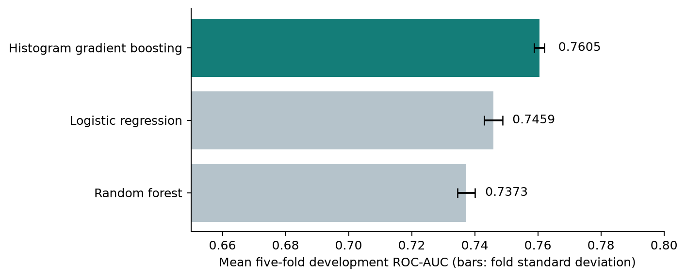
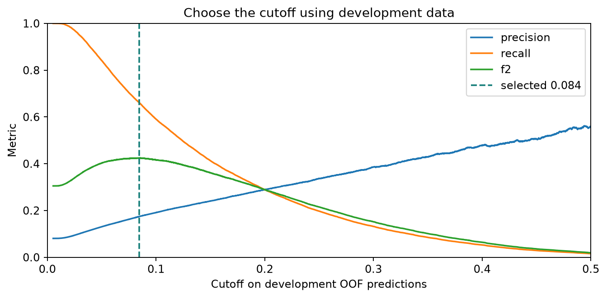
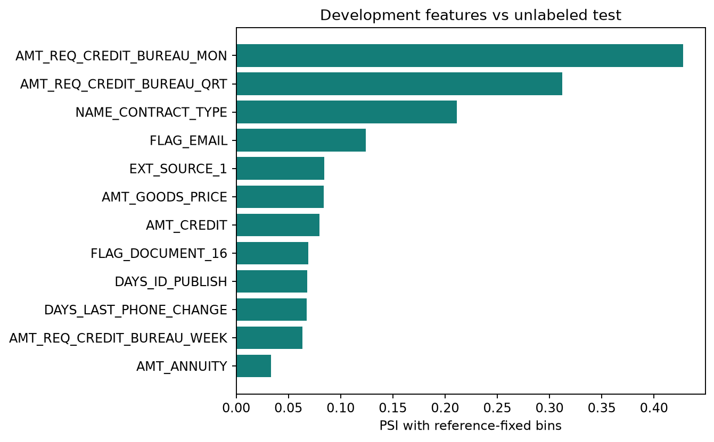

# Home Credit Default Risk

An application-table credit-risk study using **307,511 labeled applications**. The project compares three classifiers, selects a decision cutoff from development predictions, and examines calibration and train/test distribution drift.

## TL;DR

- **Model ranking:** histogram gradient boosting reached **0.7605 mean cross-validation ROC-AUC** and **0.7654 random-holdout ROC-AUC**, ahead of the configured logistic regression and random forest baselines.
- **Cutoff tradeoff:** selecting **0.0844** from development predictions raises reused-holdout recall from **1.85% to 67.19%**, while precision falls from **63.45% to 17.69%**. This is an error tradeoff; lending profit has not been measured.
- **Monitoring:** score PSI is **0.00384**, yet some input distributions shift substantially. A stable score distribution does not establish stable calibration or predictive performance.

[Technical report](reports/2026-10-04_03_home-credit/2026-10-04_02_report.md) · [PDF](reports/2026-10-04_03_home-credit/2026-10-04_03_results.pdf) · [Browser report](reports/2026-10-04_03_home-credit/2026-10-04_01_index.html) · [Experiment ledger](EXPERIMENTS.md) · [Report archive](REPORTS.md)

## Contents

1. [Results: models, cutoffs, calibration, and drift](#results)
2. [Data and validation](#data-and-validation)
3. [Reproduce the experiment](#reproduce)
4. [Repository structure](#repository-structure)
5. [Limitations and next experiments](#limitations-and-next-experiments)
6. [References](#references)

The report follows the question → experiment → evidence → decision format. The [experiment ledger](EXPERIMENTS.md) separates measured outcomes from untested ideas.

## Results

### Model comparison

All candidates use the same features and five stratified development folds. The winner is selected by mean fold ROC-AUC.

| Model | Mean CV ROC-AUC | Fold standard deviation | Holdout ROC-AUC |
| --- | ---: | ---: | ---: |
| Histogram gradient boosting | **0.7605** | 0.0016 | **0.7654** |
| Logistic regression | 0.7459 | 0.0029 | Not evaluated |
| Random forest | 0.7373 | 0.0027 | Not evaluated |



The configured gradient boosting model improves mean development AUC by **0.0145** over logistic regression. Only the winner is scored on the holdout. No Kaggle leaderboard score is available; cross-validation, holdout, and competition scores must remain separate.

### Cutoff experiment

The positive class (`TARGET = 1`) denotes repayment difficulty. The default cutoff misses most positive cases. The extension maximizes **F2 on development out-of-fold predictions**, giving recall more weight than precision.

| Rule on reused holdout | Cutoff | Precision | Recall | F2 | True positives | False positives |
| --- | ---: | ---: | ---: | ---: | ---: | ---: |
| Fixed cutoff | 0.5000 | 63.45% | 1.85% | 0.0230 | 92 | 53 |
| Development-selected F2 | **0.0844** | **17.69%** | **67.19%** | **0.4309** | **3,336** | **15,517** |

The selected rule flags **30.65%** of applications. It catches more repayment-difficulty cases at the cost of many more false positives. Changing the cutoff does not improve AUC or probability calibration.



**Evaluation boundary:** the holdout contains 61,503 rows, including 4,965 positive cases. It was inspected in the initial benchmark and reused for follow-up diagnostics. The cutoff search uses development labels only, but the follow-up holdout results are not fresh final validation.

### Calibration and drift

- Reused-holdout Brier score: **0.06733**; log loss: **0.24398**. Calibration is checked by score decile; no recalibration model was fitted.
- Same-model score PSI: **0.00384**. Both the holdout and unlabeled test table are scored by the same development-fitted model.
- Some raw feature distributions shift substantially despite the small score PSI. Distribution similarity does not establish calibration or predictive performance.



## Data and validation

Data comes from [Kaggle Home Credit Default Risk](https://www.kaggle.com/competitions/home-credit-default-risk/data). This study uses `application_train.csv` and `application_test.csv`; it does not yet aggregate the historical tables. The competition test table has **48,744 unlabeled rows**, so local test predictions cannot provide AUC.

1. Validate binary labels and unique applicant IDs. Remove the ID and target from predictors.
2. Replace the employment sentinel `365243` with missing values. Add credit/income, annuity/income, and credit/annuity ratios.
3. Make a stratified 80/20 split with seed 42: **246,008 development rows** and **61,503 holdout rows**.
4. Fit preprocessing within each training fold: median imputation, scaling, categorical imputation, and one-hot encoding with rare-category grouping.
5. Compare candidates on five shared development folds. Save out-of-fold probabilities, where each row is scored by a model that did not fit it.
6. Select the model and F2 cutoff using development predictions. Evaluate the selected configuration on the holdout and retain the original 0.5 comparison.
7. Refit the selected configuration on all labeled rows and export unlabeled test probabilities locally.

The same development folds select both the model and cutoff, so optimized development results may be optimistic. The split is random; it does not establish temporal or customer-group generalization.

## Reproduce

Run from the project root with Python 3.13 (the version used for the saved experiment).

```bash
python3 -m venv .venv
source .venv/bin/activate
python -m pip install -r requirements.txt -r requirements-reporting.txt
```

Download the competition files using your own Kaggle account and accepted competition rules. Place the train/test CSVs in `data/raw/`. Raw data, archives, predictions, and fitted models are excluded from Git.

```bash
# Full real-data benchmark and diagnostics
python -m src.train --monitoring --shap --test data/raw/application_test.csv

# Generate Markdown, HTML, PDF, figures, and compact result tables
python clean_report.py

# Run verification
python -m unittest discover -s tests -v

# Synthetic software check; scores are not Home Credit results
python -m src.train --demo --monitoring --shap
```

Training creates a new dated, numbered run folder. Reporting reads the latest completed real-data run without retraining. Use `python clean_report.py --source outputs/<run-folder>` to regenerate a particular run. Readers of the published repository can inspect the tracked report and compact tables without downloading the dataset.

LightGBM is an optional candidate (`--lightgbm`), **not evaluated in the reported experiment**. On macOS its native library may require `brew install libomp`. Other dependency versions are bounded in the requirements files, not frozen to a lockfile, so exact numerical reproduction across environments is not guaranteed.

## Repository structure

```text
src/                 Training, monitoring, data download, artifact naming
tests/               Preprocessing and monitoring checks
reports/             Dated reports, figures, compact tables, source manifests
outputs/             Local-only full predictions and fitted models
data/raw/            Local-only competition CSV inputs
data/archive/        Local-only downloaded archive
clean_report.py      Report generation from saved artifacts
EXPERIMENTS.md       Hypotheses, evidence, decisions, and untested ideas
REPORTS.md           Current report and archive index
```

Within each run, files use `YYYY-MM-DD_NN_description.ext`. `NN` is a reading-order number; the directory has its own per-date run number. Optional artifacts may leave gaps. [The report start page](reports/2026-10-04_03_home-credit/2026-10-04_00_start-here.md) describes the saved files.

## Limitations and next experiments

This is a reproducible application-table baseline with diagnostic extensions. It does not demonstrate production readiness, lending profitability, fairness, or a winning competition solution.

- The holdout has been reused. Future model development needs independent final evaluation data.
- External-score provenance and predictor availability at application time require further review.
- SHAP uses 100 development rows; permutation importance uses 500 development rows in sample. Neither is causal, and correlated predictors affect interpretation.
- PSI flags use simulated feature-wise null estimates without multiple-testing correction. There are no test labels to check test calibration or AUC.
- Historical features, hyperparameter tuning, fitted recalibration, and controlled feature ablations remain untested.

The next modeling experiment is one applicant-linked historical feature family, evaluated on unchanged development folds. [The first-place solution](https://www.kaggle.com/competitions/home-credit-default-risk/writeups/home-aloan-1st-place-solution) motivates that hypothesis; it does not establish a transferable gain for this implementation.

## References

- [William Koehrsen: Start Here - A Gentle Introduction](https://www.kaggle.com/code/willkoehrsen/start-here-a-gentle-introduction): exploratory analysis, anomalies, and baseline comparisons.


Saved results are from October 4, 2026. External sources are methodological references; their reported performance is not a controlled comparison with this project.
