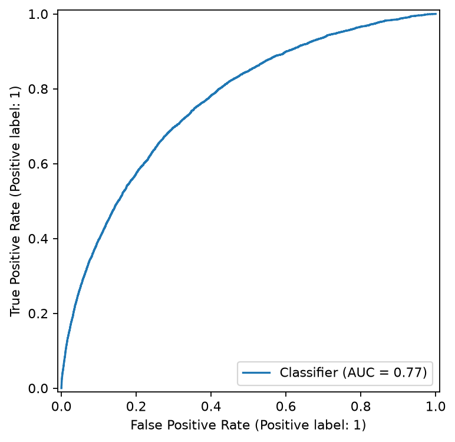
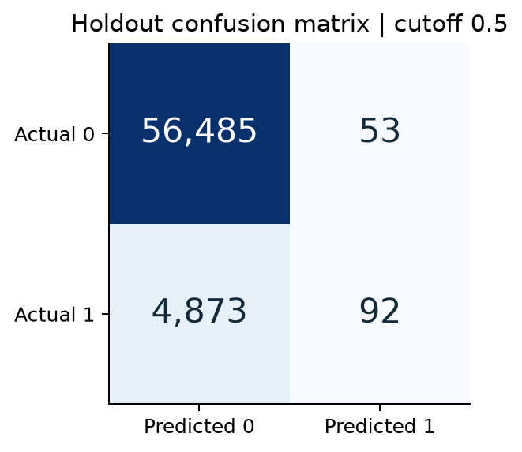
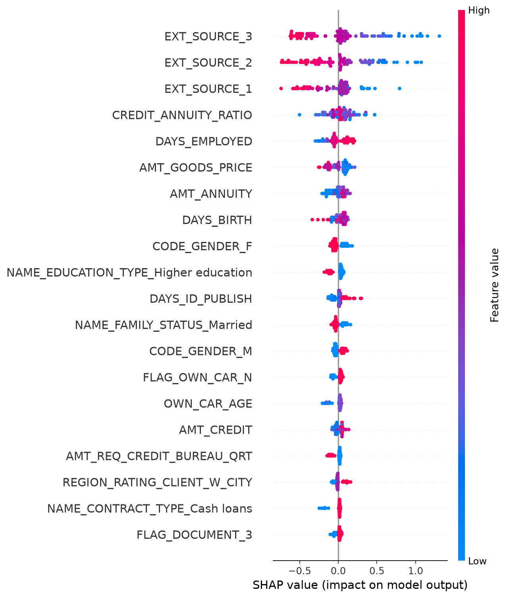

# Home Credit: model and results

Real-data run: October 04, 2026. Report regenerated: 2026-10-04 22:43 EDT. This report reads saved artifacts; it does not change or rerun the experiment.

The selected histogram gradient boosting model achieved holdout ROC-AUC 0.7654. It ranks repayment difficulty reasonably well, but at cutoff 0.5 it identifies only 1.85% of positive cases.

| Measure | Saved result |
| --- | --- |
| Labeled applications | 307,511 |
| Development / reserved holdout | 246,008 / 61,503 |
| Holdout ROC-AUC | 0.7654 |
| Holdout average precision | 0.2533 |
| Precision / recall at cutoff 0.5 | 63.45% / 1.85% |
| Local unlabeled test predictions | 48,744 |

Objective: predict TARGET = 1, which denotes repayment difficulty in the competition. TARGET = 0 denotes the other class. Applicant ID is excluded from predictors. The Kaggle test table has no labels: it supplies predictions, not a measured AUC.

How to read this report: compare models on development cross-validation, then inspect the selected model on the reserved holdout. Read the threshold counts and feature explanations before reviewing the limitations and next experiments.

## Model comparison and ranking quality

| Model | CV mean AUC | Fold SD |
| --- | --- | --- |
| Histogram gradient boosting | 0.7605 | 0.0016 |
| Logistic regression | 0.7459 | 0.0029 |
| Random forest | 0.7373 | 0.0027 |

The winner is chosen by mean fold ROC-AUC. The logistic and forest values above are development scores; this run does not report their holdout scores. Model selection must not compare these CV values as if they were Kaggle leaderboard results.

## What the default cutoff actually catches

The holdout contains 4,965 positive cases (8.07%). At cutoff 0.5, 92 are caught and 4,873 are missed. There are 53 false alarms among 56,538 negative cases.

Precision asks: of the cases flagged, how many are positive? Recall asks: of all positive cases, how many were caught? AUC does not choose a cutoff and does not guarantee calibrated probabilities. Choose a future cutoff using development out-of-fold predictions and an explicit objective, then use fresh evaluation data.

## What the model uses

The explanation below uses 100 development applicants. SHAP describes how the fitted model uses features; it does not identify causes of repayment difficulty.

The external-score fields dominate this small explanation sample. The supplied dictionary identifies them only as normalized scores from external data sources. Their provenance and application-time availability still need review. Permutation importance is computed on 500 development rows in sample and can understate correlated predictors.

## Procedure, limitations, and next experiments

| Stage | Implemented rule |
| --- | --- |
| Feature preparation | Exclude TARGET and SK_ID_CURR; replace employment sentinel 365243; add credit/income, annuity/income, and credit/annuity ratios. |
| Validation design | Seed 42; stratified 80/20 split; five stratified development folds. |
| Fold preprocessing | Numeric median imputation and scaling; categorical Missing imputation and one-hot encoding; group categories occurring fewer than 20 times. |
| Selection and evaluation | Pick highest mean CV AUC; fit on development; evaluate once on the reserved holdout at cutoff 0.5. |
| Final predictions | Refit selected configuration on all labeled rows; export probabilities for the unlabeled competition test table. |

Scope: the application table only. Secondary-table aggregation, hyperparameter search, calibration, and development-based threshold selection have not been performed. The split is random, not temporal or external. The holdout has now been inspected; repeated iteration against it cannot establish an untouched final test result.

Next experiments: (1) retain development out-of-fold predictions and define a cutoff objective; (2) compare LightGBM and historical-table features on development folds; (3) assess calibration and error patterns using fresh evaluation data. No leaderboard score, lending decision rule, or financial impact is established.

Presentation references were reviewed for organization and documentation only. External implementations use different features and evaluation designs, so their reported scores are not controlled comparisons with this run.

- [Dataset and column dictionary](https://www.kaggle.com/competitions/home-credit-default-risk/data)

- [Presentation reference: results, approach, train/test consistency](https://github.com/sdolcecanto/home-credit-default-risk)

- [Presentation reference: model comparison and explainability](https://github.com/ManishThumma/credit-risk-predictor)

- [scikit-learn: preprocessing and leakage](https://scikit-learn.org/stable/common_pitfalls.html)

