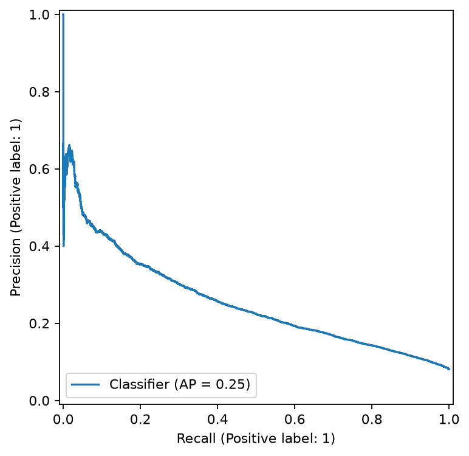
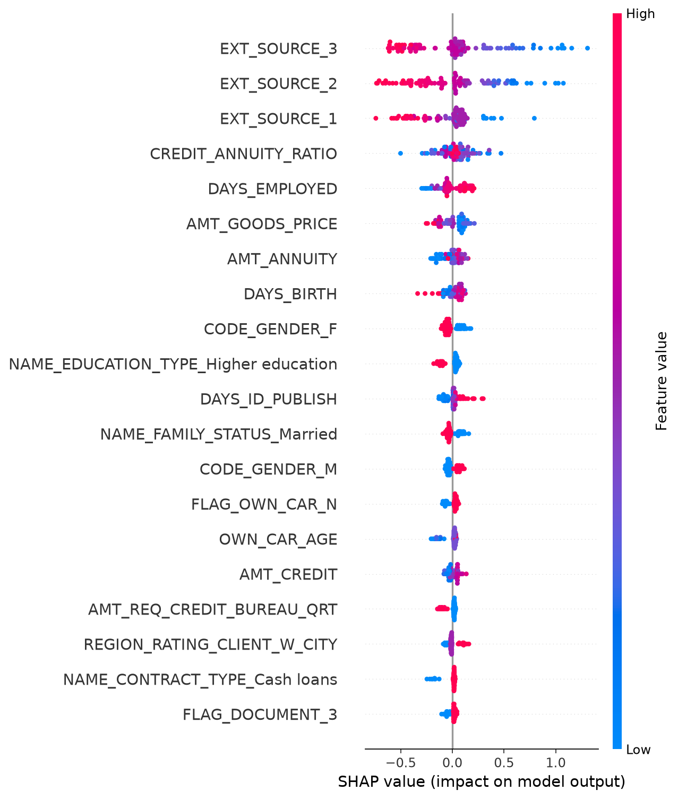
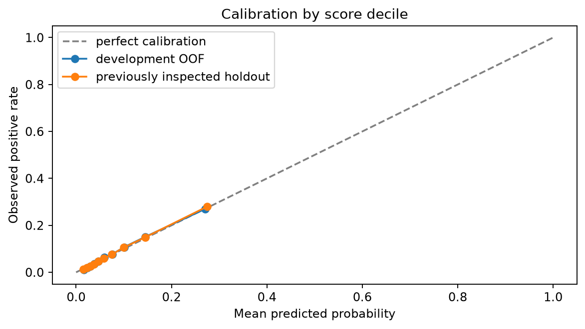

# Home Credit: credit-risk modeling

Research question: how well can application-time attributes rank repayment difficulty, and how does the classification cutoff change the errors? This study compares three classifiers, then examines probability accuracy and distribution differences between development and competition test data.

The selected histogram gradient boosting model achieved holdout ROC-AUC 0.7654 after selection on development cross-validation. At cutoff 0.5, recall is 1.85%; ranking performance alone does not establish a useful classification rule.

Monitoring extension: development F2 selects cutoff 0.0844. On the reused holdout, recall is 67.19% and precision is 17.69%. It catches 3,336 positive cases with 15,517 false positives. The AUC and model are unchanged; this is a cutoff tradeoff, not fresh final validation.

| Measure | Saved result |
| --- | --- |
| Labeled applications | 307,511 |
| Development / reserved holdout | 246,008 / 61,503 |
| Holdout ROC-AUC | 0.7654 |
| Holdout average precision | 0.2533 |
| Precision / recall at cutoff 0.5 | 63.45% / 1.85% |
| Local unlabeled test predictions | 48,744 |

Objective: predict TARGET = 1, which denotes repayment difficulty in the competition. TARGET = 0 denotes the other class. Applicant ID is excluded from predictors. The Kaggle test table has no labels: it supplies predictions, not a measured AUC.

Experiment date: October 04, 2026. Presentation updated: 2026-10-04 23:39 EDT. Results are read from saved artifacts. The random holdout has been inspected and reused for follow-up diagnostics. No Kaggle leaderboard score or temporal/external validation result is available.

## Data and experimental design

The public Home Credit competition contains application records linked to credit and repayment histories. This experiment uses the main application table only: 307,511 labeled rows and 122 input columns, including the target and applicant ID. Historical tables have not been incorporated. The positive class denotes repayment difficulty, rather than a complete measure of loan profitability.

| Stage | Protocol |
| --- | --- |
| Split | Seed 42; stratified 80/20 split: 246,008 development rows and 61,503 holdout rows. |
| Features | Exclude ID and target; replace employment sentinel 365243; add credit/income, annuity/income, and credit/annuity ratios. |
| Preprocessing | Learn numeric median imputation, scaling, categorical imputation, and one-hot categories within each training fold. Rare-category minimum count: 20. |
| Model selection | Five stratified development folds shared across all candidates; select the highest mean fold ROC-AUC. |
| Evaluation | Fit the winner on development rows; score the reserved holdout. In the extension, select F2 cutoff on development OOF predictions and diagnose the reused holdout. |

Out-of-fold (OOF) means each development row is scored by a fold model that did not fit it. The same folds are used for model and cutoff selection, so optimized development metrics may be optimistic. Applicant IDs are checked for uniqueness, but this is not a verified customer-group or time split.

Configurations: logistic regression uses max_iter=2000; random forest uses 100 trees, depth 12, and minimum leaf size 10; histogram gradient boosting uses 150 iterations, 15 leaf nodes, and L2 regularization 1. No hyperparameter search or feature-family ablation was performed.

## Experiment 1: compare model families

Hypothesis: nonlinear models can capture relationships beyond the linear baseline. All candidates use the same application features and development folds, so the comparison isolates the configured model family.

| Model | CV mean AUC | Fold SD |
| --- | --- | --- |
| Histogram gradient boosting | 0.7605 | 0.0016 |
| Logistic regression | 0.7459 | 0.0029 |
| Random forest | 0.7373 | 0.0027 |

The winner is chosen by mean fold ROC-AUC. The logistic and forest values above are development scores; this run does not report their holdout scores. Model selection must not compare these CV values as if they were Kaggle leaderboard results.

Decision: retain the development-CV winner for the remaining diagnostics. This comparison does not show that tuned forests or other boosting configurations would perform worse; only the listed configurations were evaluated.

## Baseline decision rule: cutoff 0.5

The holdout contains 4,965 positive cases (8.07%). At cutoff 0.5, 92 are caught and 4,873 are missed. There are 53 false alarms among 56,538 negative cases.

Precision asks: of the cases flagged, how many are positive? Recall asks: of all positive cases, how many were caught? AUC does not choose a cutoff and does not guarantee calibrated probabilities. Choose a future cutoff using development out-of-fold predictions and an explicit objective, then use fresh evaluation data.

## Interpretation: features used by the model

The explanation below uses 100 development applicants. SHAP describes how the fitted model uses features; it does not identify causes of repayment difficulty.

The external-score fields dominate this small explanation sample. The supplied dictionary identifies them only as normalized scores from external data sources. Their provenance and application-time availability still need review. Permutation importance is computed on 500 development rows in sample and can understate correlated predictors.

## Experiment 2: select the decision cutoff

The selected cutoff is 0.084400, chosen by maximizing development out-of-fold F2. F2 gives recall more weight than precision. This objective was chosen before running the extension; no holdout labels are used in the cutoff search. Exact ties select the highest cutoff.

| Holdout policy | Cutoff | Precision | Recall |
| --- | --- | --- | --- |
| Fixed 0.5 | 0.5000 | 63.45% | 1.85% |
| Development F2 | 0.0844 | 17.69% | 67.19% |

The selected cutoff catches 3,336 positive holdout cases, misses 1,629, and flags 15,517 negative cases. More recall comes with more false positives. A lower cutoff does not improve ROC-AUC or calibration.

The holdout was already inspected in the baseline project. These are follow-up diagnostics on reused evaluation data, not fresh final validation. F2 is a research objective and does not define a lending policy or expected profit.

## Diagnostic 1: probability calibration

Calibration compares predicted probabilities with observed positive rates. These diagnostics do not fit a recalibration model. Equal-frequency score bins are descriptive; their boundaries are estimated separately for each split.

| Split | Brier score | Log loss |
| --- | --- | --- |
| Development OOF | 0.06782 | 0.24586 |
| Reused holdout | 0.06733 | 0.24398 |

Each development probability was produced by a model that did not fit that row. However, the same development folds select the model and the cutoff, so their optimized results can be optimistic. They are development estimates, not a substitute for independent evaluation.

## Diagnostic 2: distribution drift

Same-model score PSI is 0.00384. Both holdout and unlabeled test scores come from the same development-fitted model. Raw feature PSI instead compares development rows with the unlabeled test table.

| Largest raw-feature shifts | PSI | Null 95% |
| --- | --- | --- |
| AMT_REQ_CREDIT_BUREAU_MON | 0.4278 | 0.0002 |
| AMT_REQ_CREDIT_BUREAU_QRT | 0.3122 | 0.0004 |
| NAME_CONTRACT_TYPE | 0.2114 | 0.0001 |
| FLAG_EMAIL | 0.1242 | 0.0001 |

For each feature, 250 multinomial draws estimate the no-change PSI distribution at these sample sizes, conditional on the reference bins. The 95% null flags are exploratory and are not corrected for multiple comparisons. A flagged distribution is a prompt to inspect the data, not proof of deteriorating predictions. No test labels are available to assess its calibration or AUC.

The gentle introduction informed the development-only age summary, missing-value audit, and employment-sentinel counts. These are saved as numbered tables and an age chart. They describe associations, not causal effects. Drift/calibration diagnostics follow the questions raised in Ageev's notebook; no synthetic profit claims or automatic 0.1/0.25 PSI decision rule is adopted.

## Limitations and research priorities

| Priority | Question to test |
| --- | --- |
| Historical features | Does one family of applicant-linked repayment aggregates improve development AUC on unchanged folds? |
| Alternative models | Does LightGBM add predictive value under the same features and evaluation protocol? |
| Probability and cutoff | Does fold-fitted recalibration help probability accuracy? How does the error tradeoff change under a different stated objective? |
| Independent evaluation | Can the frozen pipeline be evaluated on genuinely new labeled data with a defensible time or customer boundary? |

Scope: the application table only. Secondary-table aggregation, hyperparameter search, and fitted probability recalibration have not been performed. Development-based threshold selection and calibration/drift diagnostics are implemented. The split is random, not temporal or external. The holdout has now been inspected; repeated iteration against it cannot establish an untouched final test result.

Next experiments: compare LightGBM and historical-table features on development folds, evaluate alternative cutoff objectives and fitted recalibration, and use fresh data for final performance assessment. No leaderboard score, lending decision rule, or financial impact is established.

GitHub presentation references were reviewed for organization and documentation only. External implementations use different features and evaluation designs, so their reported scores are not controlled comparisons with this run.

- [Dataset and column dictionary](https://www.kaggle.com/competitions/home-credit-default-risk/data)

- [Presentation reference: results, approach, train/test consistency](https://github.com/sdolcecanto/home-credit-default-risk)

- [Presentation reference: model comparison and explainability](https://github.com/ManishThumma/credit-risk-predictor)

- [scikit-learn: preprocessing and leakage](https://scikit-learn.org/stable/common_pitfalls.html)

- [Nikita Ageev: PSI, drift, and cutoff diagnostics](https://www.kaggle.com/code/truenikita/home-credit-psi-drift-and-re-setting-the-cutoff)

- [William Koehrsen: EDA, anomalies, and baseline modeling](https://www.kaggle.com/code/willkoehrsen/start-here-a-gentle-introduction)

- [Home Aloan: first-place technical solution and experiment narrative](https://www.kaggle.com/competitions/home-credit-default-risk/writeups/home-aloan-1st-place-solution)

